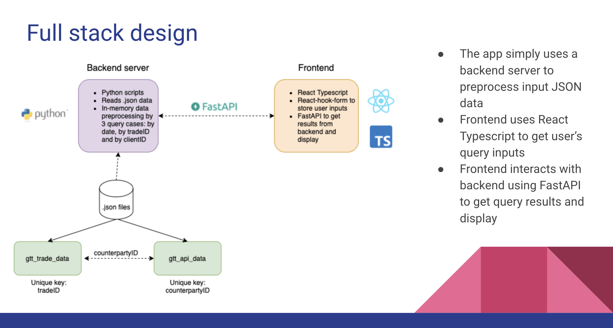
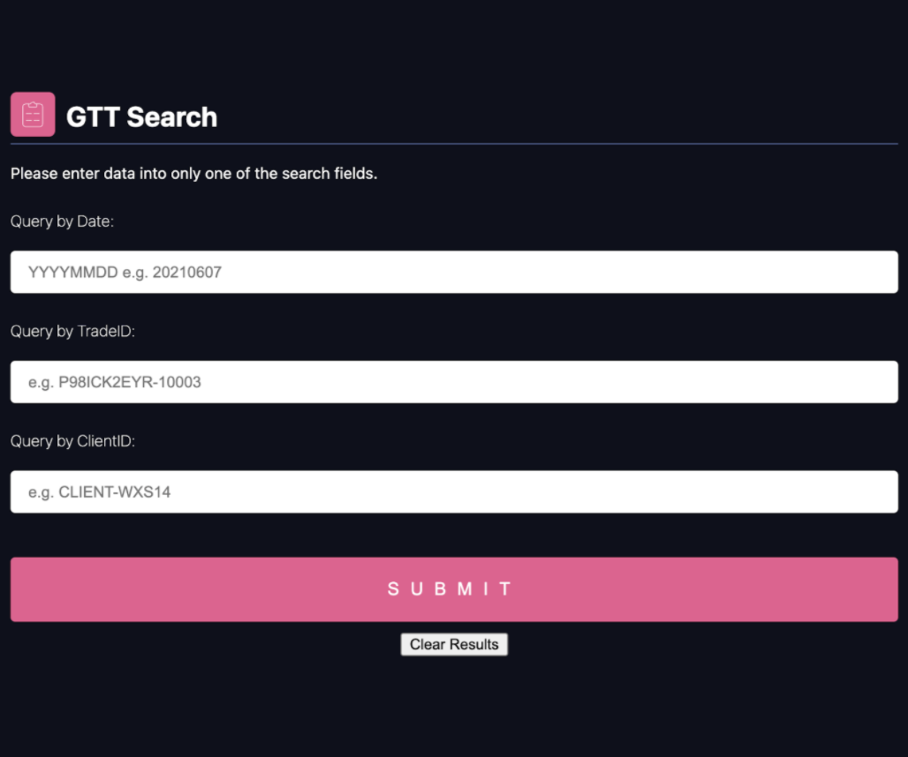
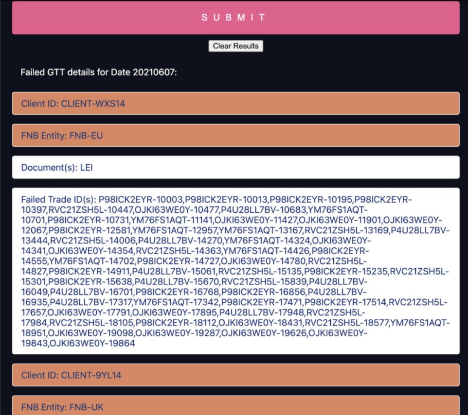

# React Typescript App for GTT Check - BofA Code to Connect 2021
Tran Thuy Dung

## Install dependencies
* Using conda enviroment
```.bash
conda create --name <env> --file requirements.txt
pip install uvicorn
pip install fastapi
```
* Start frontend (default port is 3000)
```.bash
cd ./client
npm install
npm start
```
* React app is running at http://localhost:3000
* Start backend data processor
```.bash
cd ../json-server
uvicorn gtt_check:api --reload --port 8000
```
## Question statement
* Given JSON data, design applications for Customer Support Team for post-trade review check on Good-to-Trade (GTT).
* GTT conditions and logics are given inside Word document file
* Free to design any frontend & backend framework

## Design
* The app simply uses a backend server to preprocess input JSON data
* Frontend uses React Typescript to get user’s query inputs
* Frontend interacts with backend using FastAPI to get query results and display
* Logic for validations is processed at the server side, in `/json-server/gtt_check.py`


## Snapshots
* When the Web app starts, you will see a form format as below:

* Users can input query by date, by tradeID or clientID accordingly.
* When clicking "Submit", the trades that do not pass required validations will be shown:
